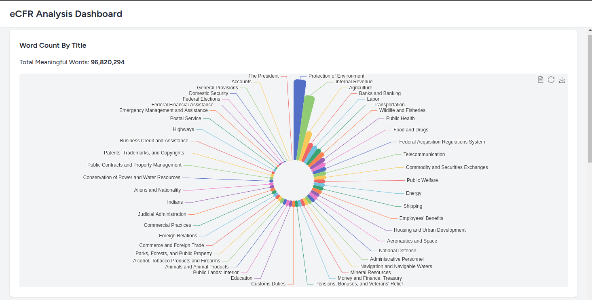
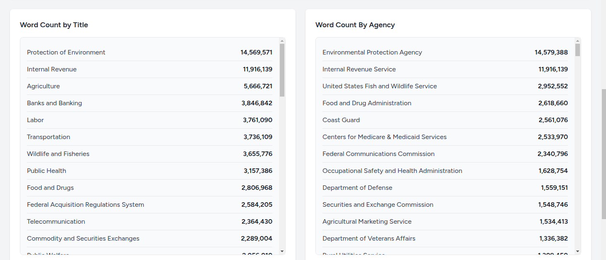
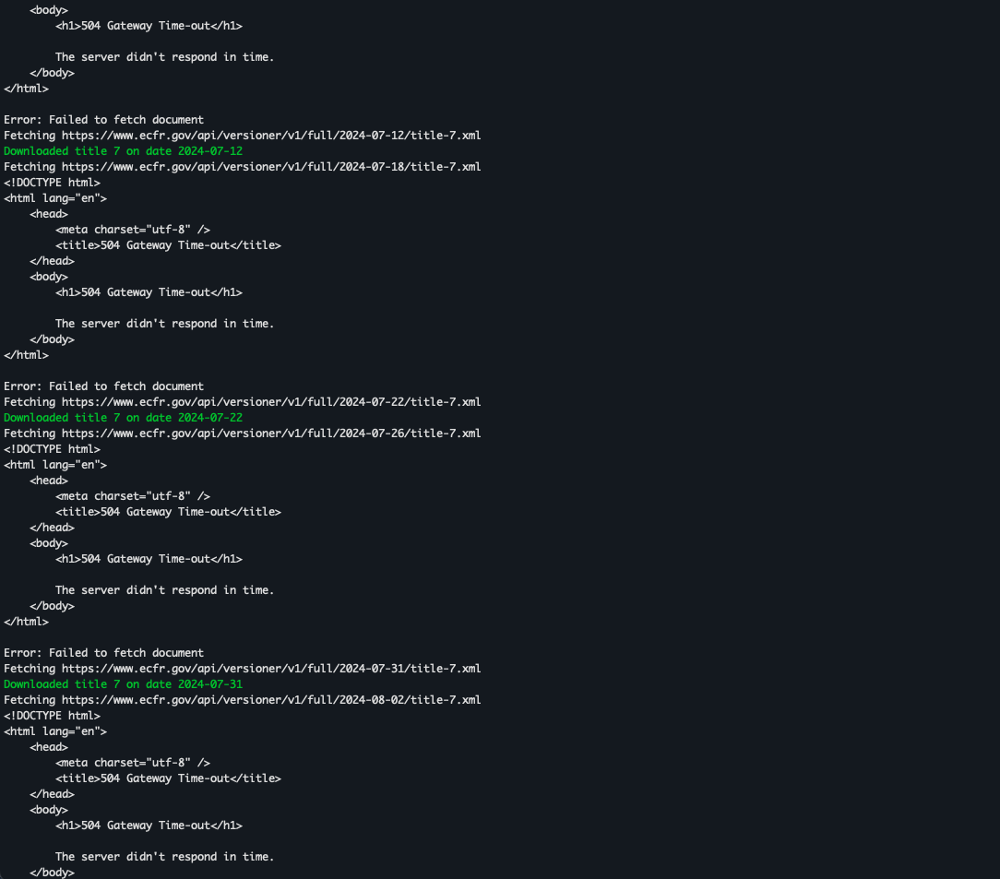

# ECFR Analyzer

**Project Notes: eCFR Analyzer**

See the [Developer Notes](./docs/dev-notes.md) for information on **Getting Started**.

## **Current Status** ##
- [x] Frontend with dashboard layout
- [x] Commands for downloading and saving all data:
  - [x] Documents, 
  - [x] Titles
  - [x] Versions,
  - [x] Structures
  - [x] All previous document histories *(API often times out, data incomplete)*
- [x] Title conversion into Markdown (800mb of titles converted in about 15 seconds)
- [x] Title conversion from Markdown into plaintext
- [x] Word count per title list
- [x] Word count of titles per agency list *(almost finished)*
- [x] Pie chart of words per title 
- [x] Pie chart of words per agency
- [ ] Querying into each title
- [ ] Querying into past history of titles
- [ ] Frequency of ammendments chart

I now have all the foundations in place to finish this project as well as explore many more options with this data. 

I think the plan should still be to download the entire history of the data, otherwise we are limited by the flaky API and the limited data it returns from its `changes` endpoint. My approach would just be to set up a script that runs until it gets no more timeout failures from the API, logging failed requests and then revisiting them after a time. I suspect that would take nearly a week to complete, but it could be running in the background without issue while other parts of the site are set up.

I think this is a much better approach to simply relying on the eCFR API. Owning the entire dataset offers an entire world of options, like feeding this data to LLMS. 

### **Markdown conversion**
- Successfully **convert eCFR XML documents into Markdown**.
- Built Rust scripts that:
  - Convert all XML title documents to Markdown in **10-15 seconds** using parallel threading.
  - Support both **fully nested**, **flat**, and **full document** storage structures:
    - **Nested:** `title-1/chapter/subchapter/part/section.md`
    - **Flat:** `title-1/section_id.md`
    - **Full** `title-1.md`
- The system is highly **efficient and scalable** for future extensions.

### **Initial Plan**

#### **Chosen Tech Stack**
- **PHP Laravel with Vue frontend** -- with Laravel I never have to reinvent the wheel. I never regret that choice.
- **Apache Echarts for charting** is my go to for frontend charting. [eCharts website](https://echarts.apache.org/examples/en/index.html#chart-type-line)
- **Local document storage for eCFR title documents**, and tracked with a **dedicated Git repo for efficient retrieval of prior versions**.
- **SQLite database for simple storage**. I could easily switch this to a MySQL server for possibly better performance in the future, but SQLite was fine for getting off the ground.
- **Rust executables for parsing title documents**. A /rust folder in my repo contains all document parsing scripts. The performance benefits of Rust are enormous here, especially with its true parallelism. 

My initial plan was to approach this in a similar fashion as my other project where I converted the entire US Federal Code into Markdown and then uploaded it to Github. 

1. **Download the entire eCFR including historical versions and track them with Git**
   - Store all data in a Git repository within the project as a coherent history of commits that could be easily queried in PHP using the [gitonomy](https://github.com/gitonomy/gitlib) package.
   - Git was chosen for its simplicity and efficiency in handling many small documents.
   - Git's ability to store only diffs instead of full files at each point in time is crucial for data compression. The ecfr history would be many hundreds of gigabytes using alternative storage approaches. 
   - Running `git gc` optimizations significantly reduces storage requirements.
   
2. **Create a Laravel application that talks to Rust scripts for parsing jobs**
   - Laravel was chosen due to its rapid development capabilities, and massive suite of both server-side and client-side features, e.g. cron jobs, database management, tons of boilerplate. 
   - Rust scripts were planned for parsing documents. I tried Python and it was *again* too slow.
   - Store current eCFR documents in an SQLite database along with metadata like agencies and version dates.

3. **Storage**
	- I juggled many possible storage solutions, but ultimately settled for simplicity. SQLite worked fine for storing simple app data, and I could always store references to files in local storage in my SQLite db and then fetch those files.  

### **Challenges Encountered**

- **Working with the eCFR API**
  - The API has aspects I appreciate, but also several pain points which became a massive time suck. 
  - **The API frequently times out**, with many requests taking over a minute. This behavior may indicate a server rate limit, but it must be enforced globally, because it was not alleviated when I switched to VPNs. 
  - Initially attempted a full download approach, similar to my US Federal Code project, but more work will be needed in retrieving the entire code from the API.
  - The API’s **structure endpoint** is *extremely* helpful for maintaining the correct hierarchy of eCFR documents.

- **Handling Historical Data**
  - Originally planned to fetch all prior history but had to table that due to API limitations.
  - Spent excessive time trying to retrieve full history. 
  - Ultimately focused on parsing current documents efficiently.

- **XML to Markdown**
  - I decided to convert the XML documents provided by the API into Markdown, which offers multiple advantages for this project:
    - Easily rendered into formatted web pages.
    - Converted to plaintext for accurate word counts.
    - Smaller file sizes compared to XML and HTML.
    - Structured for potential LLM integration.
    - Human-readable (especially when uploaded to Github).

## Conclusion
The ECFR Analyzer has progressed significantly, with the core functionality for document retrieval, parsing, and analysis already in place. By leveraging Rust for high-speed XML conversion and Laravel for backend efficiency, the system is both scalable and flexible. The decision to store historical eCFR versions in a Git repository ensures efficient tracking of changes while avoiding the limitations of the unreliable API. 

Moving forward, completing the final analytical features—such as word frequency charts and amendment tracking—will provide valuable insights into regulatory trends. Additionally, running a long-term background process to retrieve the entire history will establish a more complete and independent dataset. With these foundations, the project is well-positioned to support further enhancements, including potential LLM integrations and more sophisticated data visualizations. 
